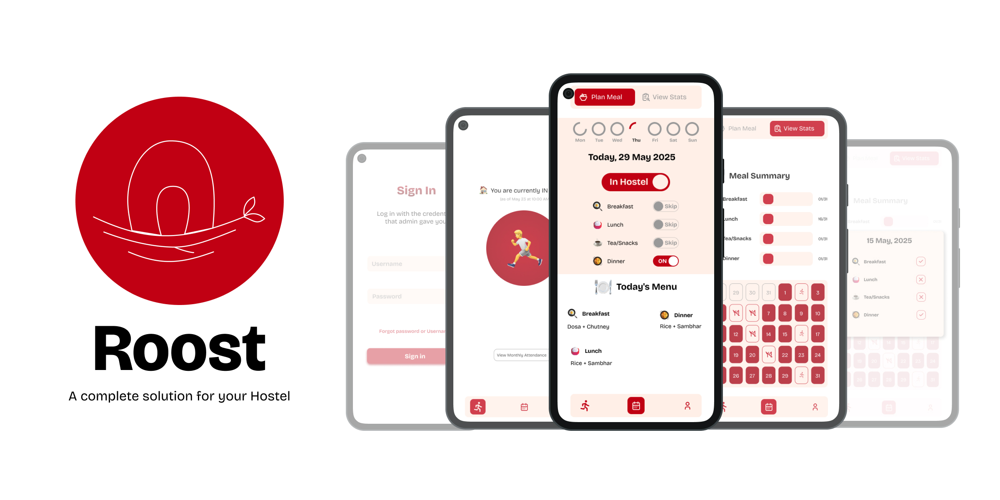

# 🏠 Roost



Roost is a mobile-first digital solution to streamline hostel-related operations such as student registration, attendance and food scheduling. It offers a centralized platform for both students and administrators to interact seamlessly and manage hostel life efficiently. Made using Flutter

---

## 🚀 Features

### 👨‍🎓 Student View
* **📊 Dashboard:**

  * Attendance tracking
  * Meal tracking

* **📆 Attendance:**

  * Toggle In/Out to mark hostel presence
  * View attendance history by date

* **🍽️ Food Scheduling:**

  * Pre-schedule food availability
  * Overview of student meal preferences by date

---

### 🛠️ Admin Dashboard (In Plans)
* **👥 Student Management (Registration):**

  * Add/Update student details
  * Move students between rooms
  * Remove students

* **📈 Attendance Overview:**

  * View individual student attendance records

---

## 🧰 Tools & Technologies

| Component          | Technology                       |
| ------------------ | -------------------------------- |
| **Planning**       | Google Docs                      |
| **Design**         | Figma                            |
| **Frontend**       | Flutter (Mobile)                 |
| **Backend**        | Express.js (Node.js)             |
| **Database**       | MongoDB Atlas                    |
| **Authentication** | OTP-based login                  |
| **Hosting**        | Vercel                           |
| **File Storage**   | Cloud storage (for profile images) |

---

## 🔐 Authentication

* username and passwords.

---

## 📦 Project Structure (Coming Soon)

```bash
.
├── frontend/         # Flutter mobile app
├── backend/          # Node.js Express API
├── docs/             # Planning & architecture, etc.
└── README.md
```

---

## 🛣️ Roadmap

* ✅ Food scheduling
* ✅ Attendance toggle and overview
* ✅ Monthly attendance analysis
* ⏳ Basic admin dashboard
* ⏳ Admin room allocation flow
* ⏳ UI polish & mobile responsiveness

---

## 👥 Target Users

* **Students:** Schedul meals and mark attendance.
* **Administrators:** Manage students and monitor attendance.

---

## 🤝 Contribution

Pull requests are welcome. For major changes, please open an issue first to discuss what you'd like to change.

---
